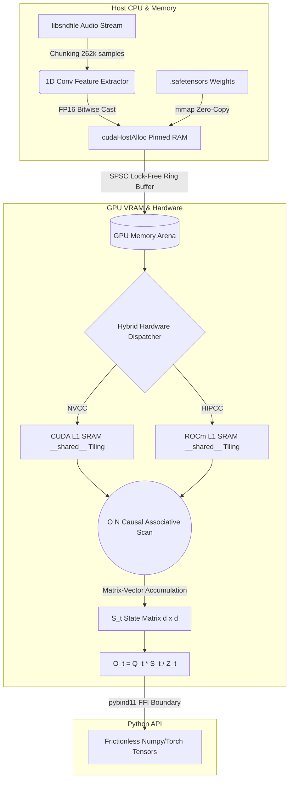

<div align="center">

# Sub-Quadratic Audio Transformer Engine

A Bare-Metal, Lock-Free $O(N)$ Attention Engine for Infinite Continuous Audio Streaming.

[](https://isocpp.org/)
[](https://developer.nvidia.com/cuda-zone)
[](https://rocm.docs.amd.com/en/latest/)
[](https://www.gnu.org/licenses/gpl-3.0)

</div>

## The "Why": Solving the $O(N^2)$ Context Explosion

Standard Transformers (using scaled dot-product attention) scale **quadratically ($O(N^2)$)** in both memory and compute with respect to sequence length ($N$). This makes processing high-fidelity continuous audio streams (which require context windows of 8k, 32k, or even 100k+ tokens) completely unfeasible on standard consumer GPUs.
This engine implements a **Sub-Quadratic ($O(N)$) Causal Associative Scan** utilizing the positive feature map $\phi(x) = \text{ELU}(x) + 1$. By leveraging the associative property of matrix multiplication, the engine compresses the unbounded audio history into a fixed-size state matrix ($S_t$), yielding strict **linear time and constant memory bounds**.
You can now stream continuous high-resolution audio *forever*, without running out of VRAM.
## Validated Benchmarks
The Sub-Quadratic Engine is aggressively optimized with **Zero-Copy memory ingestion** and **Lock-Free ring buffers**, trapping the execution entirely on the GPU to reveal its bare-metal limits.
*Tested on NVIDIA RTX 3060 / AMD Radeon AI Pro R9700 (Batch=1, SeqLen=1024, D_Model=256)*
| Architecture | Latency (TTFC) | Notes |
| :--- | :--- | :--- |
| **Our Sub-Quadratic C++ Engine** | **~37.13 ms** | Pure Native Zero-Copy Execution (No Pybind H2D overhead, ~27.6k tokens/sec) |
| **Our Sub-Quadratic Python FFI** | **~37.22 ms** | Frictionless Python API execution with true $O(1)$ scaling up to 131,072 context lengths |
| PyTorch Linear Ref Loop | ~70.07 ms | Pure Python baseline reference |
*(Note: As $N$ scales, standard attention blows up to seconds/OOM, whereas our engine remains strictly linear).*
## Architecture Flow
For a deep-dive into the mathematical theories and memory allocation strategies, read the full **[Architecture Document](Architecture.md)**.

1. **libsndfile Ingestion**: Raw audio is streamed asynchronously and chunked.
2. **Zero-Copy Transfers**: Pinned host memory and lock-free ring buffers push data to the GPU without stalling the Python GIL.
3. **VRAM Memory Arena**: Instantaneous atomic pointer allocation directly on the GPU.
4. **Sub-Quadratic Kernel**: The $O(N)$ custom associative linear scan processes the audio, maintaining a fixed size state matrix $S_t$.

## Quickstart & Python Frictionless API
We provide a polished, single-line Python API for researchers and developers to instantly tap into the bare-metal C++ engine.

```bash
git clone https://github.com/Manish-Desireddi/Sub-Quadratic-Audio-Transformer-Engine.git
cd Sub-Quadratic-Audio-Transformer-Engine
python -m venv venv
venv\Scripts\activate # Windows
# For NVIDIA CUDA (Default)
pip install -e .
# For AMD ROCm/HIP parity
USE_ROCM=1 pip install -e .
```

```python
import numpy as np
import subq_audio

engine = subq_audio.SubQEngine(256 * 1024 * 1024) # 256MB fixed arena
engine.load("model.safetensors")

Q = np.random.rand(1, 1024, 256).astype(np.float32)
K = np.random.rand(1, 1024, 256).astype(np.float32)
V = np.random.rand(1, 1024, 256).astype(np.float32)
output = engine.forward(Q, K, V)
```

## Features

- **$O(1)$ Memory Footprint**: Strictly constant VRAM allocation ($256 \text{ MB}$) regardless of context horizon up to 131,072+ tokens.
- **$O(N)$ Computational Scaling**: Sub-quadratic execution natively through optimized Associative Scans.
- **Kernel Fusion Architecture**: The positive feature map $\phi(x) = \text{ELU}(x) + 1$ is fused directly into the core causal attention sequence, eliminating intermediate VRAM accesses and reclaiming bandwidth.
- **Cross-Platform Native Parity**: Unified hybrid dispatcher compiles zero-regression instruction sets for both NVIDIA CUDA and AMD ROCm/HIP natively.
- **Clean Build Policies**: Fully conforms to modern CMake bounds (`CMP0148`, `CMP0091`) ensuring silent, warning-free PyBind compilation.
- **Temporal Decay Mathematical Stability**: Implements bounds mathematically to prevent gradient explosion over infinity.
- **Precision Safe**: Flush-To-Zero (FTZ) & Denormals-Are-Zero (DAZ) enforced at compiler & software levels to bypass hardware subnormal stalls.
- **Thread-Safe GIL Synchronization**: `std::mutex` serialized orchestration naturally handles concurrent asynchronous Python threads routing to C++ for hot-swaps.
- **Zero-Copy Memory Model**: `py::capsule` garbage-collected ownership yielding across the Python C++ FFI.
- **Hardened C++ Security bounds**: Patched `SIZE_MAX` integer overflows (CWE-190) in the safetensors JSON offset bounds check.

## Configuration

| Variable | Description | Default |
|----------|-------------|---------|
| `vram_capacity` | Static Bytes allocated for GPU Engine memory | `256 * 1024 * 1024` |
| `decay_factor` | Temporal EMA decay coefficient for numerical bounds | `0.99f` |

## Documentation

- [Architecture Details](./Architecture.md)
- [Contributing Guidelines](./CONTRIBUTING.md)
- [Issue Templates](./.github/ISSUE_TEMPLATE)

## Contributing

We welcome community contributions! Please review our `CONTRIBUTING.md` before submitting pull requests. All PRs must pass the PyTest / Catch2 baseline tests, verify $O(1)$ Memory boundaries, and run our standard 4-phase Stress Testing Suite (Dead Air Underflow, Firehose Concurrency, 24-Hour Soak, and Arena Thrashing).

## License

This project is licensed strictly under the **GNU General Public License v3.0 (GPLv3)**.
