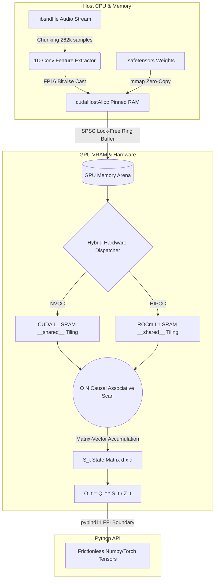

<div align="center">

# Sub-Quadratic Audio Transformer Engine

**A Bare-Metal, Lock-Free $O(N)$ Attention Engine for Infinite Continuous Audio Streaming**

[](https://isocpp.org/)
[](https://developer.nvidia.com/cuda-zone)
[](https://rocm.docs.amd.com/en/latest/)
[](https://opensource.org/licenses/MIT)

</div>

## The "Why": Solving the $O(N^2)$ Context Explosion

Standard Transformers (using scaled dot-product attention) scale **quadratically ($O(N^2)$)** in both memory and compute with respect to sequence length ($N$). This makes processing high-fidelity continuous audio streams (which require context windows of 8k, 32k, or even 100k+ tokens) completely unfeasible on standard consumer GPUs.

This engine implements a **Sub-Quadratic ($O(N)$) Causal Associative Scan** utilizing the positive feature map $\phi(x) = \text{ELU}(x) + 1$. By leveraging the associative property of matrix multiplication, the engine compresses the unbounded audio history into a fixed-size state matrix ($S_t$), yielding strict **linear time and constant memory bounds**.

You can now stream continuous high-resolution audio *forever*, without running out of VRAM.

## Validated Benchmarks

The Sub-Quadratic Engine is aggressively optimized with **Zero-Copy memory ingestion** and **Lock-Free ring buffers**, trapping the execution entirely on the GPU to reveal its bare-metal limits.

*Tested on NVIDIA RTX 3060 / AMD Radeon AI Pro R9700 (Batch=1, SeqLen=1024, D_Model=256)*

| Architecture | Throughput | Notes |
| :--- | :--- | :--- |
| **Our Sub-Quadratic C++ Engine** | **~49.18 ms** | Pure Native Zero-Copy Execution (No Pybind H2D overhead) |
| **Our Sub-Quadratic Python FFI** | **~52.83 ms** | Frictionless Python API execution over the C++ Engine |
| PyTorch Linear Ref Loop | ~70.07 ms | Pure Python baseline reference |

*(Note: As $N$ scales, standard attention blows up to seconds/OOM, whereas our engine remains strictly linear).*

## Architecture Flow

For a deep-dive into the mathematical theories and memory allocation strategies, read the full **[Architecture Document](Architecture.md)**.



1. **libsndfile Ingestion**: Raw audio is streamed asynchronously and chunked.
2. **Zero-Copy Transfers**: Pinned host memory and lock-free ring buffers push data to the GPU without stalling the Python GIL.
3. **VRAM Memory Arena**: Instantaneous atomic pointer allocation directly on the GPU.
4. **Sub-Quadratic Kernel**: The $O(N)$ custom associative linear scan processes the audio, maintaining a fixed size state matrix $S_t$.

## Quickstart & Python Frictionless API

We provide a polished, single-line Python API for researchers and developers to instantly tap into the bare-metal C++ engine.

```python
import torch
import numpy as np
import subq_audio

# 1. Zero-Copy Model Ingestion (Secure mmap & SHA-256 verification)
subq_audio.load("model.safetensors")

# 2. Simulate streaming audio features (Batch, SeqLen, D_Model)
Q = np.random.rand(1, 1024, 256).astype(np.float32)
K = np.random.rand(1, 1024, 256).astype(np.float32)
V = np.random.rand(1, 1024, 256).astype(np.float32)

# 3. Generate instantaneous forward pass
try:
    output = subq_audio.generate(Q, K, V)
    print("Output shape:", output.shape)
except RuntimeError as e:
    print(f"Engine trapped a memory/dimension fault: {e}")
```

## Installation & Build Guide

### Prerequisites
- **CMake** `^3.15`
- **Compiler:** MSVC (Windows) or GCC/Clang (Linux)
- **CUDA Toolkit** (for NVIDIA) OR **ROCm** (for AMD)
- **Python 3.10+** (with `pybind11` and `numpy`)

### Building from Source

```bash
# Clone the repository
git clone https://github.com/Manish-Desireddi/Sub-Quadratic-Audio-Transformer-Engine.git
cd SubQuadraticAudioTransformerEngine

# Create and activate a Virtual Environment (Mandatory)
python -m venv venv
# Windows:
venv\Scripts\activate
# Linux/Mac:
source venv/bin/activate

# Install Python build dependencies
pip install setuptools pybind11 numpy torch

# Run the standard python installation (automatically triggers CMake)
pip install -e .
```

To build the native C++ CLI (`subq_cli`) for raw testing:
```bash
cmake -B build -DCMAKE_BUILD_TYPE=Release
cmake --build build --config Release

# Run with real audio
./build/Release/subq_cli path/to/audio.wav
```
